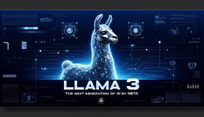

Step 1 : Open Terminal and in the terminal click on plus icon and choose command prompt

Step 2 : Follow the Below Given Steps 

    # if any previous environment is working then close it using 
          --> conda deactivate
          
    # Create a New Environment
          --> conda create -p venv python==3.12
          
    # Activate the New Environment
          --> conda activate "X"    {X = (Name being displayed before writing this line)}
          
    # Install all the requirements 
          --> pip install -r requirements.txt

Step 3 :  Download a model file required for the project and paste it in the models folder being created the download file link is given below 

          [Download The File](https://huggingface.co/TheBloke/Llama-2-7B-Chat-GGML/blob/main/llama-2-7b-chat.ggmlv3.q8_0.bin)

Step 4 : After Everthing is done 

     # For Running the Project type 
        --> streamlit run app.py
